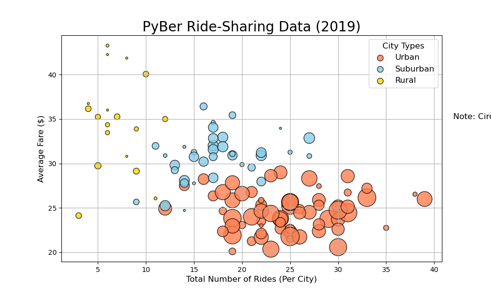
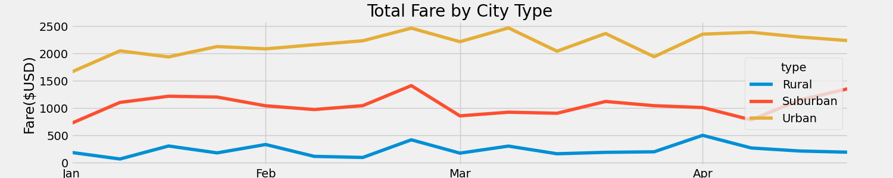
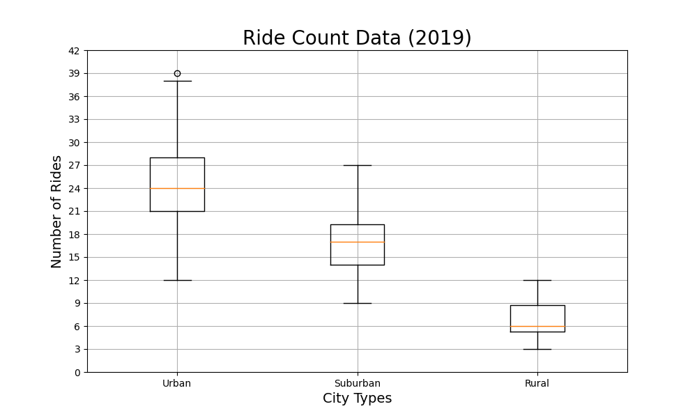
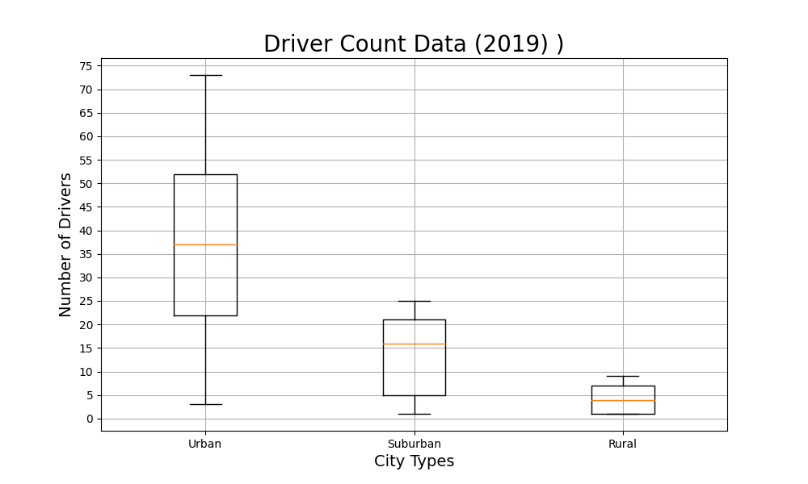
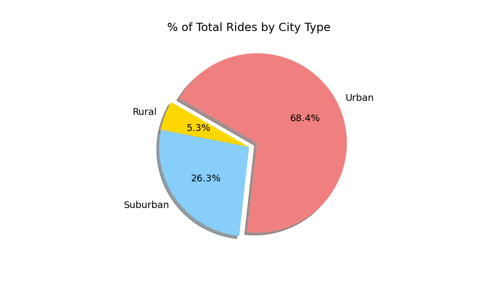
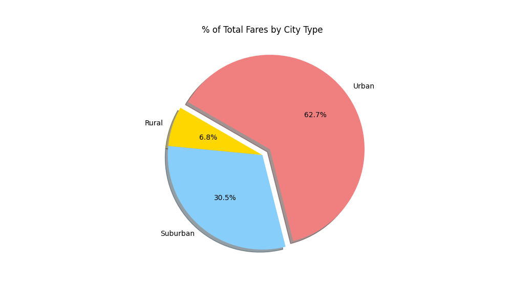

# Analysis of Pyber Comparative Data by City Type

## Overview
### Goal 
    We wanted to look at the use patterns for drivers and riders based on whether they were in a rural, subuurban or urban area with 
    with the end goal of improving access and affordability. 
### Method 
    Taking the info in the ride_data.csv file and the city_data.csv file we were able to create data frames that allowed us to break down the, when, where, how often, and how much of Pybers riders and drivers. We then used Matplotlib to turn this info into easily understood visualizations.

## Results
   
    Starting with this first graph we see that there is a trend that with increased density comes increased ride frequency and shorter rides with lower fares. This shouldn't be surprising lower population density in the Suburbs and Rural areas means less potential riders and greater distances between homes and services. 
    Looking at 
    we see that fares generally track and stay around the same range of plus or minus $300. This shows that ridership is steady in each type of city over time. 
    Throughout the data we see that Urban areas have the largest number of rides, driverks, and the most money coming in from fares. 
## Summary
    If we look at the  versus the  we see a strong over representation of drivers in urban cities and an under representation of drivers in rural cities. We also see when we compare  and  that rural and Suburban areas make up an outsized proportion of fares to the number of rides being taken there. 
### Suggestion 1
    Incentivize more drivers to be active in rural and suburban cities. 
### Suggestion 2 
    Lower fares specifically in rural cities to encourage ridership.
### Suggestion 3 
    Incresase fare cost in urban cities to bring them more in line with the the percentage of rides being taken. 